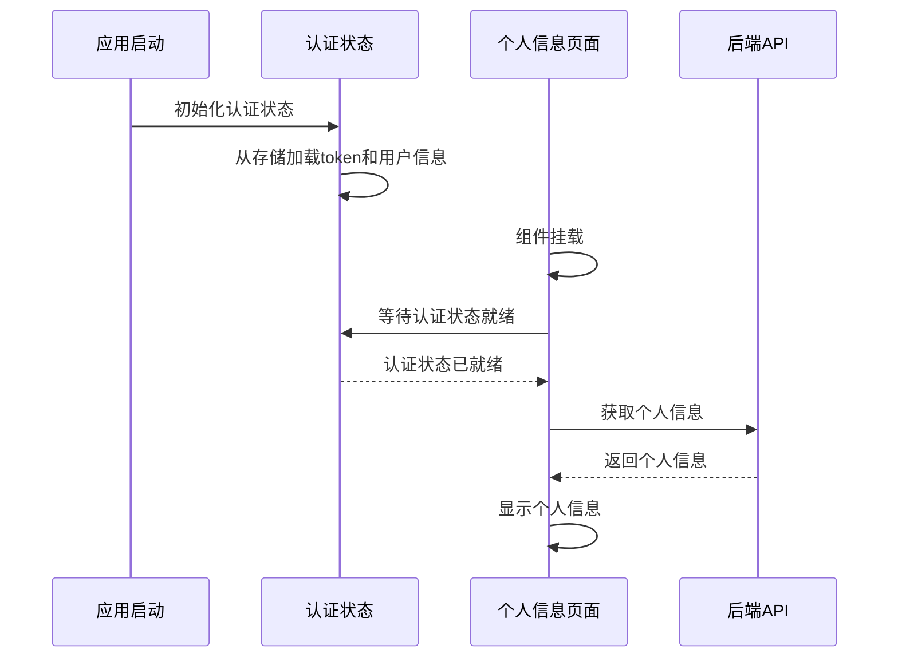

# 个人信息页面加载问题修复设计文档

## 概述

本设计文档描述了如何修复个人信息页面首次加载时的竞态条件问题。主要通过改进认证状态管理、添加适当的加载状态处理和确保数据依赖的正确初始化来解决问题。

## 架构

### 问题根因分析

1. **竞态条件**：`ProfileView.vue` 在 `onMounted` 时立即调用 `fetchProfile`，但此时 `authStore.loginState.doctorId` 可能还未初始化
2. **认证状态初始化时机**：应用启动时认证状态的初始化可能晚于页面组件的挂载
3. **错误处理不当**：将认证状态未初始化的情况误判为API错误

### 解决方案架构



## 组件和接口

### 1. 认证状态管理增强

**文件：** `doctor_app/src/stores/auth.ts`

**修改内容：**
- 添加 `isInitialized` 状态标识认证状态是否已完全初始化
- 添加 `waitForInitialization()` 方法供组件等待认证状态就绪
- 改进 `initAuth()` 方法，确保初始化完成后设置 `isInitialized = true`

### 2. 个人信息页面组件优化

**文件：** `doctor_app/src/views/ProfileView.vue`

**修改内容：**
- 修改 `fetchProfile()` 方法，在获取个人信息前等待认证状态初始化
- 添加更精确的加载状态管理
- 改进错误处理，区分认证错误和API错误

### 3. 应用初始化流程

**文件：** `doctor_app/src/main.ts`

**修改内容：**
- 确保在创建Vue应用前完成认证状态初始化
- 添加初始化完成的确认机制

## 数据模型

### 认证状态扩展

```typescript
interface LoginState {
  isLoading: boolean
  isInitialized: boolean  // 新增：标识认证状态是否已初始化
  lastLoginTime: number | null
  rememberPhone: boolean
  savedPhone: string
  doctorId?: number
}
```

### 组件状态管理

```typescript
interface ProfileState {
  loading: boolean
  authLoading: boolean  // 新增：认证状态加载中
  initialized: boolean  // 新增：组件是否已初始化
}
```

## 错误处理

### 1. 认证状态错误

- **场景**：认证状态初始化失败
- **处理**：显示认证错误提示，引导用户重新登录
- **用户体验**：清晰的错误信息和操作指引

### 2. API调用错误

- **场景**：个人信息API调用失败
- **处理**：区分404（医生不存在）和其他服务器错误
- **用户体验**：提供重试选项和错误详情

### 3. 网络错误

- **场景**：网络连接问题
- **处理**：显示网络错误提示，提供重试功能
- **用户体验**：离线状态提示和自动重试机制

## 测试策略

### 1. 单元测试

- **认证状态管理**：测试 `initAuth()` 和 `waitForInitialization()` 方法
- **个人信息组件**：测试不同认证状态下的组件行为
- **错误处理**：测试各种错误场景的处理逻辑

### 2. 集成测试

- **页面导航**：测试从不同页面导航到个人信息页面的场景
- **认证流程**：测试登录后立即访问个人信息页面的场景
- **状态同步**：测试认证状态在多个组件间的同步

### 3. 端到端测试

- **首次访问**：模拟用户首次登录后访问个人信息页面
- **页面刷新**：测试页面刷新后的状态恢复
- **网络异常**：模拟网络异常情况下的用户体验

## 性能考虑

### 1. 初始化优化

- 认证状态初始化应该尽可能快速
- 避免不必要的API调用
- 使用缓存减少重复请求

### 2. 用户体验优化

- 添加骨架屏或加载动画
- 实现渐进式加载
- 优化错误状态的视觉反馈

### 3. 内存管理

- 正确清理事件监听器
- 避免内存泄漏
- 优化组件的生命周期管理