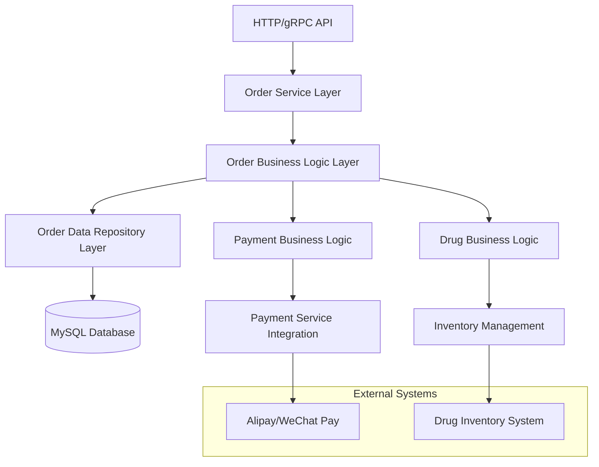

# Design Document

## Overview

The order management system is designed as a comprehensive solution for handling medical drug orders within the existing Kratos-based microservice architecture. The system follows the established patterns of the current codebase, utilizing the three-layer architecture (Service → Biz → Data) with proper dependency injection via Wire.

The system integrates with the existing payment infrastructure and drug inventory management to provide a complete order-to-fulfillment workflow. It leverages GORM for database operations, Redis for caching, and maintains transactional consistency across order creation, payment processing, and inventory updates.

## Architecture

### System Components



### Layer Responsibilities

1. **Service Layer** (`internal/service/order.go`)
   - HTTP/gRPC endpoint handling
   - Request validation and response formatting
   - Protocol buffer message conversion

2. **Business Logic Layer** (`internal/biz/order.go`)
   - Core business rules and workflows
   - Transaction orchestration
   - Integration with payment and inventory systems

3. **Data Repository Layer** (`internal/data/order.go`)
   - Database operations and queries
   - Data model transformations
   - GORM-based persistence

## Components and Interfaces

### Core Data Models

#### Order Entity (mt_orders table)
```go
type MtOrder struct {
    ID            int64           `gorm:"primaryKey;autoIncrement"`
    OrderNo       string          `gorm:"uniqueIndex;size:50;not null"`
    UserID        int64           `gorm:"index;not null"`
    UserName      string          `gorm:"size:50"`
    UserPhone     string          `gorm:"size:20"`
    DoctorID      int64           `gorm:"index"`
    DoctorName    string          `gorm:"size:50"`
    AddressID     int64           `gorm:"index"`
    AddressDetail string          `gorm:"size:200"`
    TotalAmount   decimal.Decimal `gorm:"type:decimal(10,2);not null"`
    PayType       string          `gorm:"size:10"`
    Status        OrderStatus     `gorm:"size:20;not null;default:'待支付'"`
    PayTime       *time.Time      `gorm:"type:datetime(3)"`
    DrugTime      *time.Time      `gorm:"type:datetime(3)"`
    SendTime      *time.Time      `gorm:"type:datetime(3)"`
    FinishTime    *time.Time      `gorm:"type:datetime(3)"`
    CancelTime    *time.Time      `gorm:"type:datetime(3)"`
    Remark        string          `gorm:"size:500"`
    CreatedAt     time.Time       `gorm:"autoCreateTime"`
    UpdatedAt     time.Time       `gorm:"autoUpdateTime"`
}

type OrderStatus string
const (
    StatusPending    OrderStatus = "待支付"
    StatusPaid       OrderStatus = "已支付"
    StatusPreparing  OrderStatus = "配药中"
    StatusShipped    OrderStatus = "已发货"
    StatusCompleted  OrderStatus = "已完成"
    StatusCancelled  OrderStatus = "已取消"
)
```

#### Order Items Entity
```go
type MtOrderItem struct {
    ID        int64           `gorm:"primaryKey;autoIncrement"`
    OrderID   int64           `gorm:"index;not null"`
    DrugID    int64           `gorm:"index;not null"`
    DrugName  string          `gorm:"size:100;not null"`
    Quantity  int32           `gorm:"not null"`
    Price     decimal.Decimal `gorm:"type:decimal(10,2);not null"`
    Subtotal  decimal.Decimal `gorm:"type:decimal(10,2);not null"`
    CreatedAt time.Time       `gorm:"autoCreateTime"`
}
```

### Repository Interfaces

```go
type OrderRepo interface {
    // Order CRUD operations
    CreateOrder(ctx context.Context, order *MtOrder) error
    GetOrderByID(ctx context.Context, id int64) (*MtOrder, error)
    GetOrderByOrderNo(ctx context.Context, orderNo string) (*MtOrder, error)
    UpdateOrderStatus(ctx context.Context, orderNo string, status OrderStatus, timestamp time.Time) error
    ListUserOrders(ctx context.Context, userID int64, page, pageSize int32) ([]*MtOrder, int64, error)
    
    // Order Items operations
    CreateOrderItems(ctx context.Context, items []*MtOrderItem) error
    GetOrderItems(ctx context.Context, orderID int64) ([]*MtOrderItem, error)
    
    // Transaction support
    WithTx(ctx context.Context, fn func(ctx context.Context) error) error
}

type DrugInventoryRepo interface {
    CheckInventory(ctx context.Context, drugID int64, quantity int32) (bool, error)
    ReserveInventory(ctx context.Context, drugID int64, quantity int32) error
    ReduceInventory(ctx context.Context, drugID int64, quantity int32) error
    ReleaseReservedInventory(ctx context.Context, drugID int64, quantity int32) error
}
```

### Business Logic Interfaces

```go
type OrderUsecase interface {
    // Order lifecycle
    CreateOrder(ctx context.Context, req *CreateOrderRequest) (*MtOrder, error)
    ProcessPayment(ctx context.Context, orderNo string, paymentInfo *PaymentInfo) error
    UpdateOrderStatus(ctx context.Context, orderNo string, status OrderStatus) error
    CancelOrder(ctx context.Context, orderNo string, reason string) error
    
    // Order queries
    GetOrder(ctx context.Context, orderNo string) (*OrderDetail, error)
    ListUserOrders(ctx context.Context, userID int64, page, pageSize int32) ([]*OrderSummary, int64, error)
}
```

## Data Models

### Request/Response Models

```go
type CreateOrderRequest struct {
    UserID        int64                `json:"user_id" validate:"required"`
    UserName      string               `json:"user_name" validate:"required"`
    UserPhone     string               `json:"user_phone" validate:"required"`
    DoctorID      int64                `json:"doctor_id"`
    DoctorName    string               `json:"doctor_name"`
    AddressID     int64                `json:"address_id" validate:"required"`
    AddressDetail string               `json:"address_detail" validate:"required"`
    Items         []*CreateOrderItem   `json:"items" validate:"required,min=1"`
    Remark        string               `json:"remark"`
}

type CreateOrderItem struct {
    DrugID   int64 `json:"drug_id" validate:"required"`
    Quantity int32 `json:"quantity" validate:"required,min=1"`
}

type PaymentInfo struct {
    PayType     string          `json:"pay_type" validate:"required,oneof=1 2 3"`
    Amount      decimal.Decimal `json:"amount" validate:"required"`
    TradeNo     string          `json:"trade_no"`
    PaymentTime time.Time       `json:"payment_time"`
}

type OrderDetail struct {
    Order *MtOrder       `json:"order"`
    Items []*MtOrderItem `json:"items"`
}

type OrderSummary struct {
    OrderNo     string          `json:"order_no"`
    TotalAmount decimal.Decimal `json:"total_amount"`
    Status      OrderStatus     `json:"status"`
    ItemCount   int32           `json:"item_count"`
    CreatedAt   time.Time       `json:"created_at"`
}
```

## Error Handling

### Custom Error Types

```go
type OrderError struct {
    Code    string `json:"code"`
    Message string `json:"message"`
    Details string `json:"details,omitempty"`
}

const (
    ErrOrderNotFound        = "ORDER_NOT_FOUND"
    ErrInsufficientStock    = "INSUFFICIENT_STOCK"
    ErrInvalidOrderStatus   = "INVALID_ORDER_STATUS"
    ErrPaymentFailed        = "PAYMENT_FAILED"
    ErrInventoryUpdateFailed = "INVENTORY_UPDATE_FAILED"
)
```

### Error Handling Strategy

1. **Validation Errors**: Return HTTP 400 with detailed field validation messages
2. **Business Logic Errors**: Return HTTP 422 with business-specific error codes
3. **System Errors**: Return HTTP 500 with generic error messages (log detailed errors)
4. **Not Found Errors**: Return HTTP 404 with resource-specific messages

## Testing Strategy

### Unit Testing

1. **Business Logic Tests**
   - Order creation workflow validation
   - Payment processing logic
   - Status transition validation
   - Inventory integration scenarios

2. **Repository Tests**
   - Database operations with test database
   - Transaction rollback scenarios
   - Concurrent access handling

3. **Service Layer Tests**
   - HTTP endpoint testing
   - Request/response validation
   - Error response formatting

### Integration Testing

1. **Database Integration**
   - Full order lifecycle with real database
   - Transaction consistency verification
   - Concurrent order processing

2. **Payment Integration**
   - Mock payment service integration
   - Payment callback handling
   - Payment failure scenarios

3. **Inventory Integration**
   - Stock reservation and release
   - Concurrent inventory updates
   - Inventory shortage handling

### Test Data Management

```go
type OrderTestData struct {
    ValidOrder    *CreateOrderRequest
    InvalidOrder  *CreateOrderRequest
    TestDrugs     []*MtDrug
    TestUser      *User
    TestAddress   *Address
}

func SetupOrderTestData() *OrderTestData {
    // Setup test data for consistent testing
}
```

## Performance Considerations

### Database Optimization

1. **Indexing Strategy**
   - Primary indexes on order_no, user_id, status
   - Composite indexes for common query patterns
   - Foreign key indexes for joins

2. **Query Optimization**
   - Use prepared statements for frequent queries
   - Implement pagination for large result sets
   - Optimize joins between orders and order_items

3. **Connection Pooling**
   - Configure appropriate connection pool sizes
   - Monitor connection usage and adjust as needed

### Caching Strategy

1. **Redis Caching**
   - Cache frequently accessed order details
   - Cache user order summaries
   - Implement cache invalidation on order updates

2. **Cache Keys Design**
   ```
   order:detail:{order_no}
   user:orders:{user_id}:page:{page}
   order:status:{order_no}
   ```

### Concurrency Handling

1. **Database Transactions**
   - Use database transactions for multi-table operations
   - Implement proper isolation levels
   - Handle deadlock scenarios gracefully

2. **Inventory Locking**
   - Implement optimistic locking for inventory updates
   - Use Redis distributed locks for critical sections
   - Handle race conditions in stock reservation

## Security Considerations

### Data Protection

1. **Sensitive Data Handling**
   - Encrypt user phone numbers in database
   - Mask sensitive information in logs
   - Implement data retention policies

2. **Access Control**
   - Validate user ownership of orders
   - Implement role-based access for admin operations
   - Audit trail for order modifications

### Input Validation

1. **Request Validation**
   - Validate all input parameters
   - Sanitize user-provided data
   - Implement rate limiting for order creation

2. **Business Rule Validation**
   - Verify user permissions for order operations
   - Validate order status transitions
   - Check inventory availability before order creation

## Monitoring and Observability

### Metrics Collection

1. **Business Metrics**
   - Order creation rate
   - Payment success rate
   - Order completion time
   - Inventory shortage incidents

2. **Technical Metrics**
   - API response times
   - Database query performance
   - Error rates by endpoint
   - Cache hit rates

### Logging Strategy

1. **Structured Logging**
   ```go
   log.WithFields(log.Fields{
       "order_no": orderNo,
       "user_id": userID,
       "action": "create_order",
       "duration": duration,
   }).Info("Order created successfully")
   ```

2. **Log Levels**
   - INFO: Successful operations and business events
   - WARN: Recoverable errors and unusual conditions
   - ERROR: System errors and failed operations
   - DEBUG: Detailed execution flow (development only)

## Deployment Considerations

### Database Migration

1. **Schema Changes**
   - Use versioned migration scripts
   - Implement backward-compatible changes
   - Plan for zero-downtime deployments

2. **Data Migration**
   - Migrate existing order data if applicable
   - Validate data integrity after migration
   - Implement rollback procedures

### Configuration Management

1. **Environment-Specific Settings**
   - Database connection parameters
   - Payment service endpoints
   - Cache configuration
   - Logging levels

2. **Feature Flags**
   - Enable/disable new order features
   - A/B testing for order flow improvements
   - Gradual rollout of changes